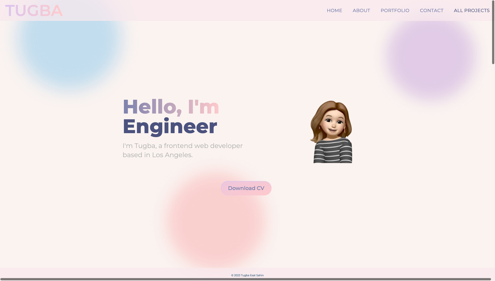
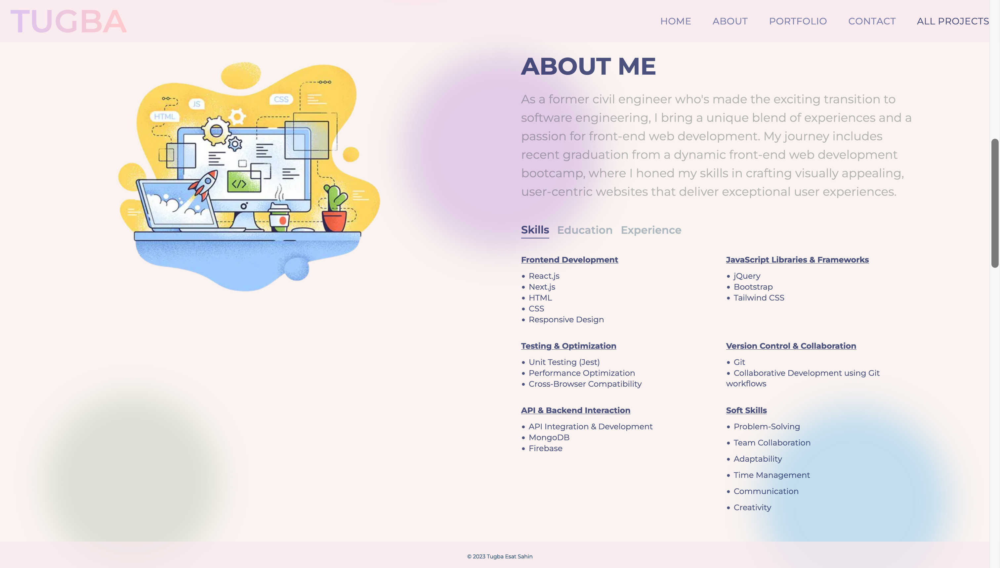
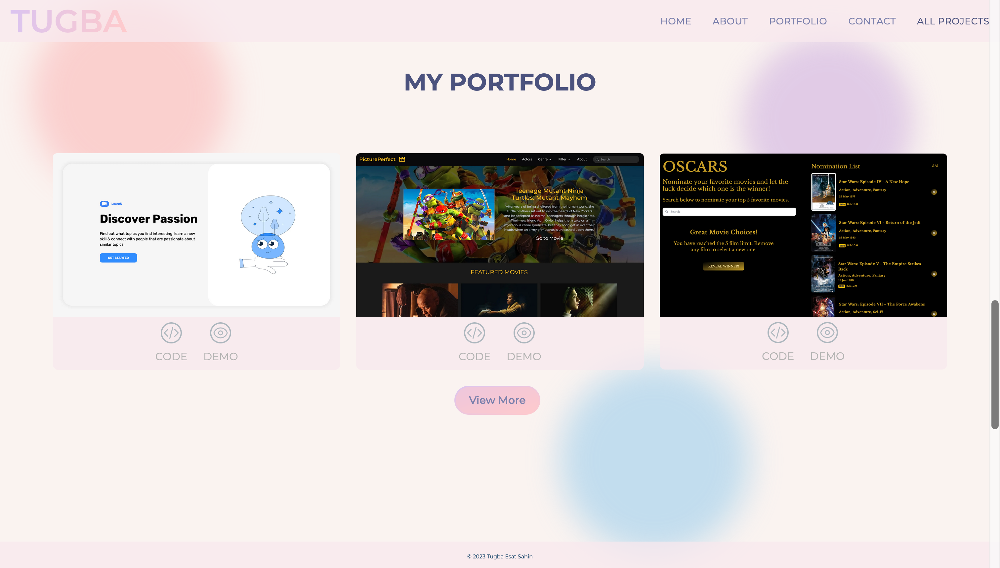
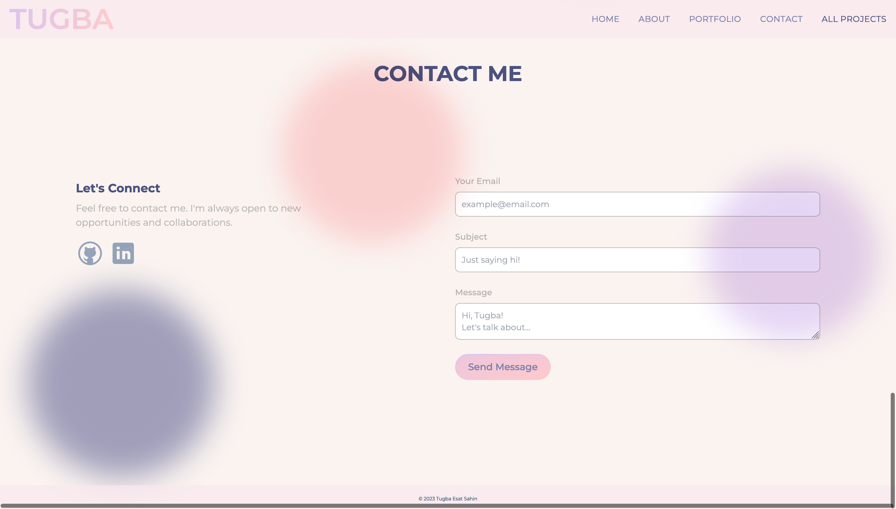
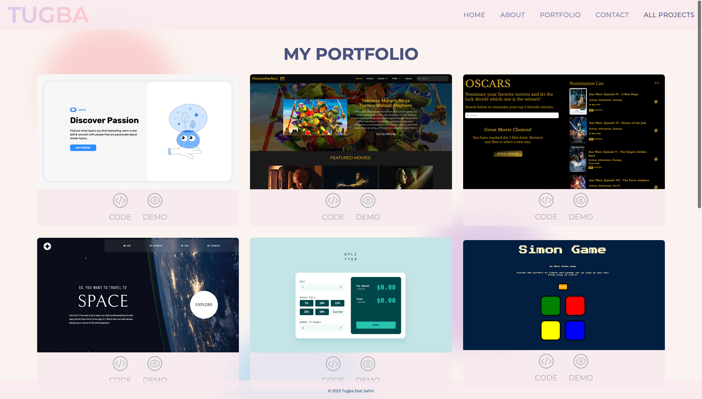

# Portfolio Showcase - Personal Website

This project is a personal portfolio website, providing visitors with the opportunity to download my CV, learn more about me, explore my projects, and easily get in touch.

## Technologies, Frameworks and Libraries: 🐍 ⚛️

- **Frontend:** Next.js, React, Material-UI, Framer Motion, and React Type Animation for dynamic and visually appealing elements.
 
- **Styling:** Utilized Tailwind CSS for a sleek and responsive design.

- **Communication:** Integrated Resend for streamlined communication methods.

[Next.js](https://nextjs.org/)
[React](https://react.dev/)
[Tailwind CSS](https://tailwindcss.com/)
[Material-UI](https://mui.com/material-ui/)
[Framer Motion](https://www.framer.com/motion/)
[Resend](https://resend.com)

## Project Properties: 🚀

- **Dynamic Web Design:** Developed a dynamic and responsive website using Next.js, React, and Material-UI for an engaging user experience.

- **Visual Dynamism:** Incorporated Framer Motion and React Type Animation for visually dynamic elements and effects.

- **Communication Efficiency:** Utilized Resend to facilitate streamlined communication methods for efficient interactions.

- **Responsive Design:** Ensured a sleek and responsive design through the use of Tailwind CSS, providing an optimal viewing experience on various devices.

## Live Demo of the Project: 📹
- Live Site URL: [Portfolio Website](https://tugbaesat.vercel.app)
  
## Screenshots: 📷

### Hero Section

### About Section

### Portfolio Section

### Contact Section

### All Projects Section

## Authors: 💻
- Website - [Tugba Esat Sahin](https://tugbaesatsahin.vercel.app)
- GitHub - [@tugbaesat](https://github.com/tugbaesat)
